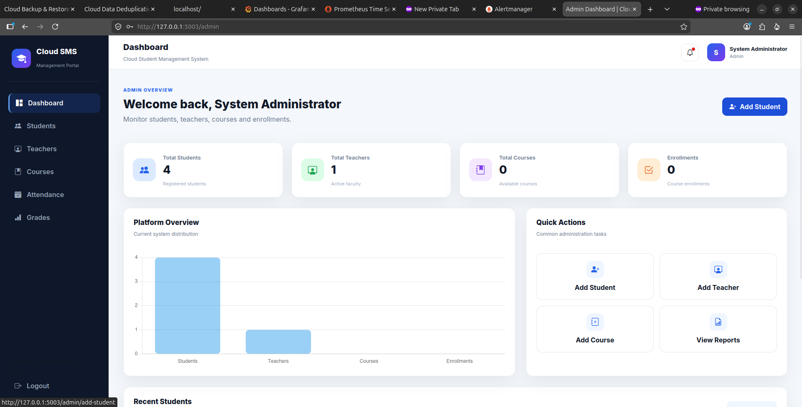
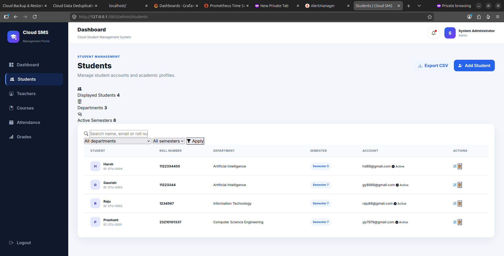
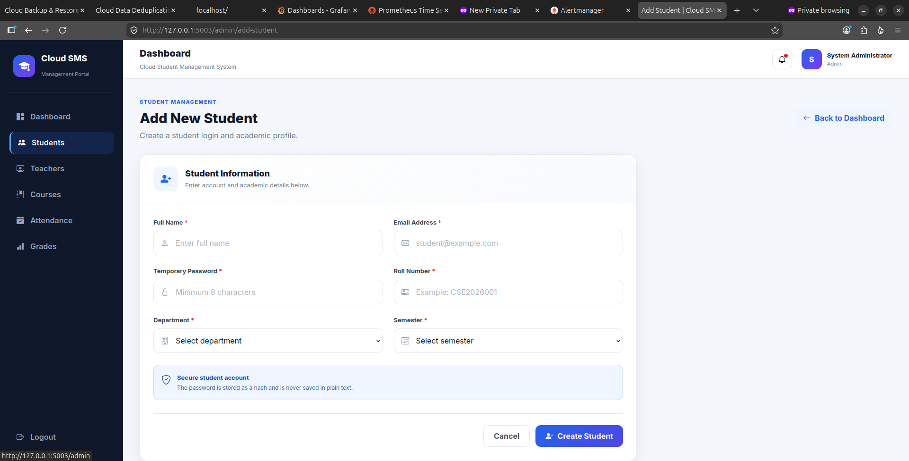
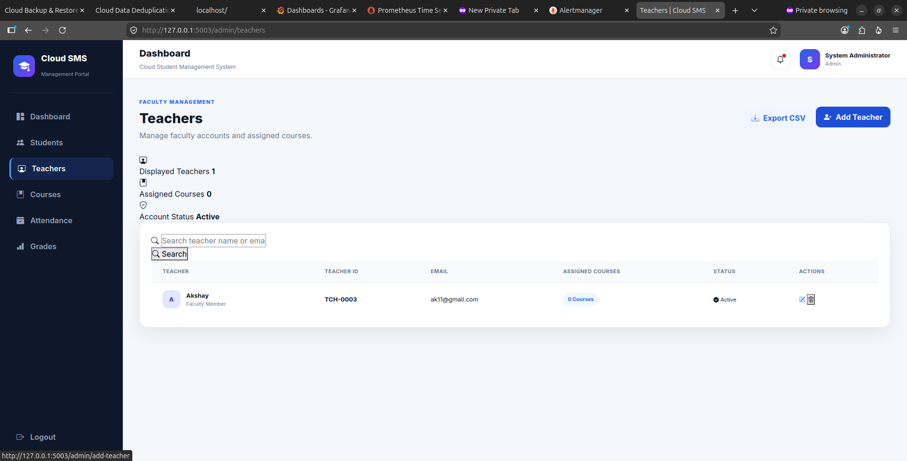
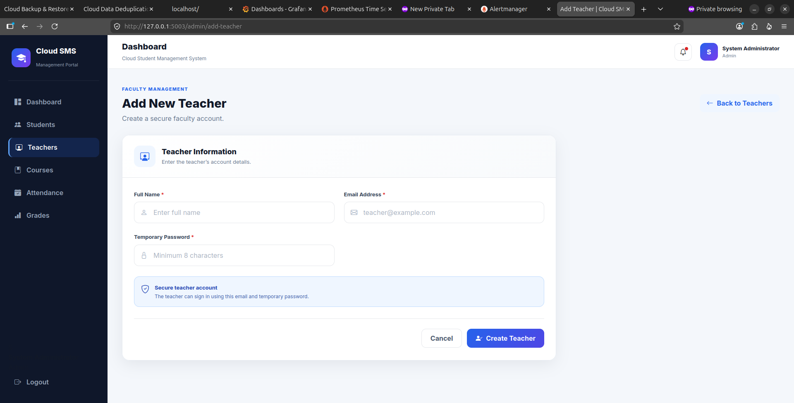
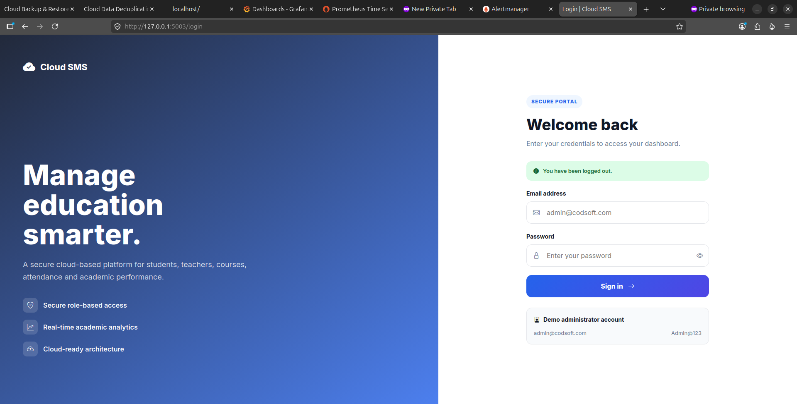

# 🎓 Cloud Student Management System

A modern web-based Student Management System developed using **Flask** and **SQLite** as part of the **CodSoft Cloud Computing Internship - Task 5**.

The application provides secure authentication and an easy-to-use dashboard for managing students and teachers through a clean and responsive interface.

---

# 📌 Features

## Authentication
- Admin Login
- Teacher Login
- Student Login
- Secure Password Hashing
- Logout

## Student Management
- Add Student
- View Students
- Search Students
- Edit Student
- Delete Student

## Teacher Management
- Add Teacher
- View Teachers
- Search Teachers
- Edit Teacher
- Delete Teacher

## Dashboard
- Modern Responsive UI
- Statistics Cards
- Sidebar Navigation
- Flash Notifications

---

# 🛠 Technologies Used

- Python 3
- Flask
- Flask Login
- Flask SQLAlchemy
- SQLite
- HTML5
- CSS3
- Bootstrap Icons
- Jinja2

---

# 📂 Project Structure

```
Cloud_Student_Management_System/
│
├── app.py
├── models.py
├── requirements.txt
├── database/
├── static/
│   ├── css/
│   ├── js/
│   └── images/
├── templates/
│   ├── admin/
│   ├── auth/
│   ├── layout/
│   ├── student/
│   └── teacher/
└── README.md
```

---

# 🚀 Installation

Clone the repository

```bash
git clone <repository-url>
```

Open the project

```bash
cd Cloud_Student_Management_System
```

Create virtual environment

```bash
python3 -m venv venv
```

Activate virtual environment

Linux

```bash
source venv/bin/activate
```

Install dependencies

```bash
pip install -r requirements.txt
```

Run the project

```bash
python3 app.py
```

Open your browser

```
http://127.0.0.1:5003
```

---

# 🔑 Default Admin Login

Email

```
admin@codsoft.com
```

Password

```
Admin@123
```

---

# 📸 Screenshots

## Admin Dashboard



---

## Student Management



---

## Add Student



---

## Teacher Management



---

## Add Teacher



---

## Login Page


---

# 🎯 Future Improvements

- Course Management
- Attendance Management
- Grade Management
- Email Notifications
- Report Generation

---
## Live AWS Deployment

The application is deployed on AWS EC2 using Gunicorn and Nginx.

**Live URL:** http://13.233.132.248

# 👨‍💻 Developer

**Prashant Yadav**

B.Tech Computer Science Engineering

CodSoft Cloud Computing Internship

---

# 📜 License

This project is developed for educational purposes as part of the CodSoft Internship Program.
